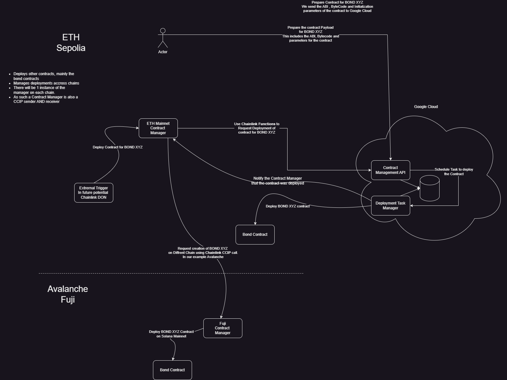

# Smartbonds ContractManager Project

This project integrates Chainlink Functions and Chainlink CCIP to create a smart contract
that can deploy contracts across multiple blockchains.

This is the rough design for it, though it may still change over time.

The directory structure is as follows:
- contracts: Holds the solidity contracts that will be compiled by hardhat compile.
- design: Holds design artifacts, right now just a PNG of the proposed flow that will be implemented
- functions: This is where the javascript code of the function is, this function is mainly a passthrough to a Google API
- simconfig: This directory is used to store the configuration for simulated chainlink functions.
- scripts & tasks: These directories came from the hardhat "plugin" from chainlink these are needed for running the functions simulator
- secrets: This holds the typescript code necessary to deploy secrets to the DON. The secret we pass is the Google API key.
- test: This holds tests for the solidity contract used when calling hardhat test
- ignition: is the directory used by ignition from hardhat. The main sub-directory in there is the modules directory which holds the 
typescript code needed to deploy the contracts (right now only 1). The other deployments directory holds info about prior deploys we
are keeping that info in the repo as may need to be able to reference data in future. 

The following are a few noteworthy files in the root of the project
- network.js: This is needed by the chainlink simulator framework. It holds a whole bunch of network details to various blockchain networks.
- .env: This holds environment variable names which are all either keys or secrets. This file points to references in 1Password. 
If you need to do an integration with another secrets provider you may have to change this.
- .env.build: Has the same variables above populated with fake data, as for some of the npm script the variables are needed though never used.

The contract is in the SBContractManager and these are the constructor parameters we need to feed it:
- functionRouter: The router address for functions
- ccipRouter: The router address for CCIP calls
- linkToken: The address of the link token to use to pay for transactions 
- subId: The Functions subscription ID
- donId: The Functions DON ID for managing secrets and other parameters
- deployCode: The actual Javascript source code that will be used for the Functions request
- gasLimit: the gas limit to use when calling CCIP or Functions.

The details of these can be found in the deployment module under ignition.

The contract SBBaseContract contract is a simple ERC20 contract used for testing out the ContractManager logic. 

In package.json you will find the following executable scripts:

### `npm run testContract`

Runs `hardhat test` to execute the contract test suite. Its very limited now as I don't have a way to test chainlink functions end-to-end.

### `npm run buildCode`

Simply runs `tsc` to compile the typescript code

### `npm run buildContract`

Runs `hardhat compile` to compile the contracts

### `npm run simulateFunction`

This will run the functions simulator on our function code.
#### TODO - integrate this with the test suite.

### `npm run deployContractManager <network>`

Can be used to deploy the SBContractManager contract on the provided network. Note that this script
calls the 1Password CLI under the covers so as to be able to read in the private key needed for the deployment.

### `npm run deployLocal`

This does the same as the above deployment but targets the local hardhat network, so you should make sure to have started it.

### `npm run deploySecrets`

This deploys the secrets (Google API key) to the DON, they stay valid in there for 24hrs. Again this scripts requires 
the use of the 1Password CLI.

### `npm run node`

This script will start the hardhat blockchain simulation network locally.
